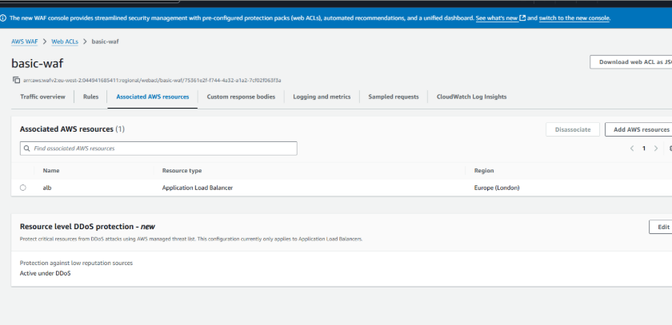

# 🚀 URL Shortener on ECS Fargate — Production-Grade Deployment (ECS v2)

This project is a **production-ready AWS architecture** for deploying a containerized Python URL shortener using **ECS Fargate**, **Terraform**, and **CI/CD with GitHub OIDC → CodeDeploy**.

It builds upon the original CoderCo ECS challenge and extends it into a **secure, automated, multi-environment stack** with **blue/green deployments**, **WAF protection**, and **CloudWatch monitoring**.

---

## 🏗️ Architecture Overview

**Stack highlights**
- **ECS Fargate** – serverless compute for containerized workloads  
- **ALB + Blue/Green Target Groups** – safe deployment switching via CodeDeploy  
- **WAF (Web ACL)** – filters malicious traffic before reaching the ALB  
- **Route 53 + ACM** – custom domain with automatic TLS  
- **ECR** – Docker image registry  
- **Terraform Modules** – reusable IaC for VPC, ALB, ECS, IAM, WAF, CloudWatch  
- **GitHub OIDC → CodeDeploy** – secure CI/CD pipeline (no long-lived AWS keys)  
- **Multi-Environment Setup** – `dev`, `staging`, and `prod` folders using a shared S3 + DynamoDB backend  

---

## 🖼️ Key Components

### Demo Video

https://github.com/user-attachments/assets/bc4f4f55-18e5-496b-b660-bc25d9e33571

> A simple FastAPI UI that accepts a URL, shortens it, and stores the mapping in DynamoDB.  
> Designed to demonstrate secure and production-ready container deployment using ECS Fargate, ALB, WAF, and CodeDeploy blue/green.

> A simple FastAPI UI that accepts a URL, shortens it, and stores the mapping in DynamoDB. Designed to demonstrate secure and production-ready container deployment using ECS Fargate, ALB, CodeDeploy blue/green, and WAF.

---

### 🔹 OIDC Pipeline Integration

GitHub Actions authenticates directly with AWS via OIDC — no static credentials.  
This ensures **secure, short-lived tokens** for Terraform plan/apply and image deployment.

---

### 🔹 CodeDeploy Blue/Green

Traffic between blue and green target groups is shifted automatically after successful health checks, ensuring **zero-downtime deployments**.

---

### 🔹 WAF Configuration

AWS WAF protects the ALB from malicious patterns (SQL i, XSS, bad bots).  
Custom rules and rate limiting policies are defined through Terraform.

---

### 🔹 Private Endpoints

VPC Interface Endpoints for CloudWatch, ECR, and Logs keep all ECS traffic internal to AWS.  
No data leaves the VPC, improving security and latency.

---
## 🚀 CI/CD Deployment Summary — URL Shortener on ECS Fargate

This project implements a **fully automated CI/CD pipeline** using **GitHub Actions**, **ECR**, **EventBridge**, **Lambda**, and **CodeDeploy** to deploy a containerized FastAPI application onto **ECS Fargate** with **Blue/Green deployments** and zero downtime.

---

### 🔄 End-to-End Flow

1. **Developer Commit** → A push to `dev`, `staging`, or `main` triggers the GitHub Actions workflow.  
2. **Build Stage** → GitHub Actions builds the Docker image, runs static analysis (**Checkov**, **TFLint**, **Trivy**), validates Terraform, and authenticates via **OIDC** (no stored AWS keys).  
3. **Push to ECR** → The Docker image is tagged and pushed to **Amazon ECR**.  
4. **EventBridge Trigger** → Detects the ECR image push and triggers a **Lambda** function.  
5. **Lambda Automation** → Lambda registers a new ECS task definition and triggers **CodeDeploy**.  
6. **Blue/Green Deployment** → CodeDeploy shifts traffic gradually from **blue** to **green** using ALB listeners.  
7. **Validation & Cutover** → Health checks confirm green stability, then blue tasks are terminated automatically.

---

### 📊 Summary Table

| Stage | Trigger | AWS / Service | Action |
|-------|----------|----------------|--------|
| 🧑‍💻 Developer commit | Git push | **GitHub Actions** | Lint, scan, and build Docker image |
| 🐳 Build & Push | CI workflow | **Docker + ECR** | Build and push image to ECR |
| ⚡ ECR push event | ECR image upload | **EventBridge** | Invoke Lambda trigger |
| 🧠 Automation | EventBridge event | **Lambda** | Register new ECS task + trigger CodeDeploy |
| 🚀 Deployment | Lambda output | **CodeDeploy** | Perform Blue/Green deployment |
| ✅ Validation | Health checks | **ECS Fargate + ALB** | Confirm healthy targets and cutover traffic |

---

**Result:**  
A secure, automated, and production-ready pipeline that continuously delivers container updates to ECS with zero downtime, full rollback capability, and Terraform-managed infrastructure.

---

## 🧠 Key Learnings

- Implementing **secure CI/CD without AWS keys**
- Managing **multi-env Terraform state** (S3 + DynamoDB)
- Designing **rollback-ready deployments** via CodeDeploy
- Integrating **AWS WAF + CloudWatch dashboards** for visibility
- Troubleshooting ECS Fargate target health and listener routing

---

## 📂 Repository Structure

app/ # FastAPI app
infra/
├── modules/ # Reusable Terraform modules (vpc, ecs, alb, waf, etc.)
├── envs/ # dev / staging / prod configurations
└── global/ # Backend (S3+DynamoDB) state setup
.github/workflows/ # CI/CD pipelines (Build + Deploy)

---

## 🧩 Tech Stack

| Category | Tools |
|-----------|-------|
| Cloud | AWS (ECS Fargate, ECR, ALB, WAF, Route 53, ACM, CloudWatch) |
| IaC | Terraform v1.9+ |
| CI/CD | GitHub Actions + OIDC → CodeDeploy |
| Language | Python (FastAPI) |
| Security | AWS WAF + Private VPC Endpoints |
| Monitoring | CloudWatch Logs + Dashboards |

---

## 🧭 Next Steps

- Add **CloudWatch Alarms → SNS notifications**
- Introduce **Checkov / Tfsec** for IaC security
- Automate **rollback on 5xx error threshold**
- Publish as a **Terraform module template**

---

### 🏁 Outcome

A fully automated, production-grade **ECS Fargate deployment** demonstrating:
- Infrastructure as Code discipline  
- Secure OIDC CI/CD integration  
- Blue/green release management  
- Layer-7 security via WAF  
- Cloud-native observability and resilience  

---

