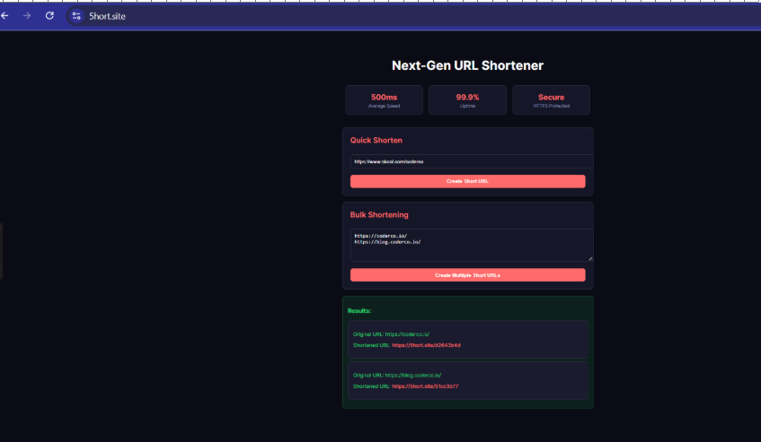
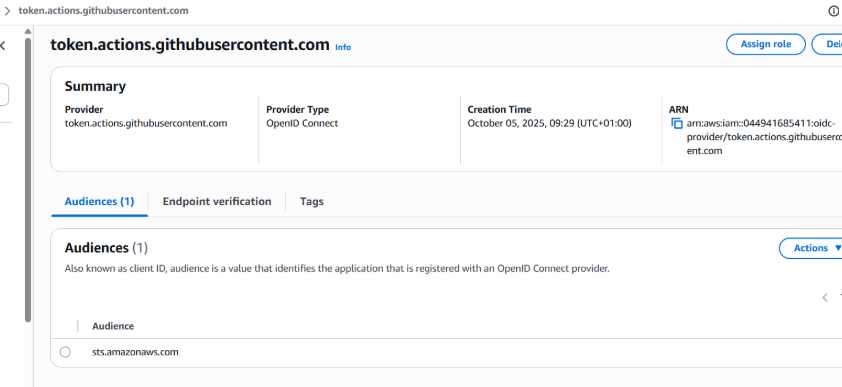
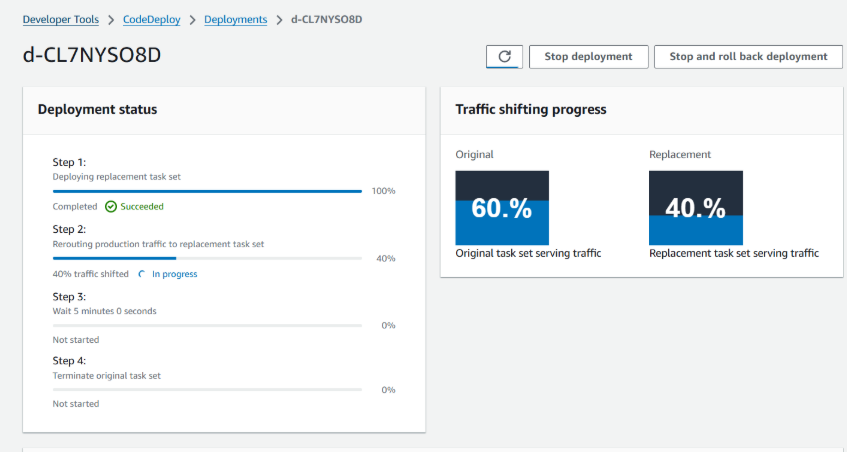
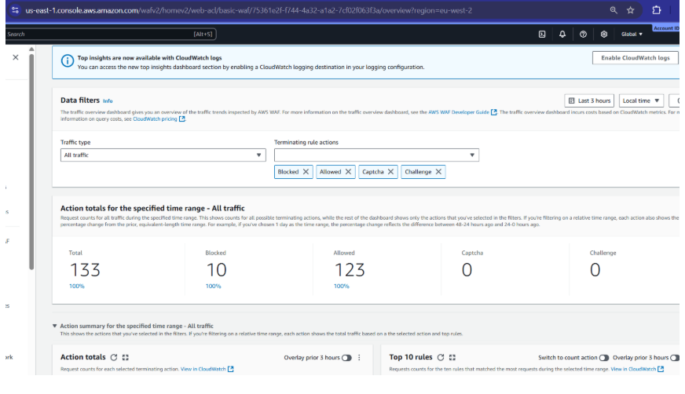
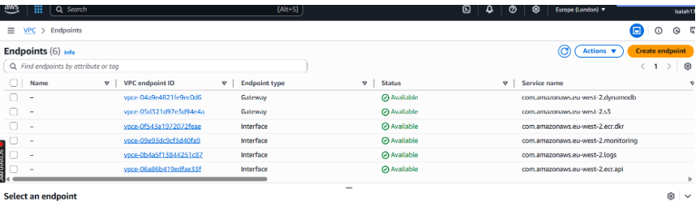

# 🚀 URL Shortener on ECS Fargate — Production-Grade Deployment (ECS v2)

This project is a **production-ready AWS architecture** for deploying a containerized Python URL shortener using **ECS Fargate**, **Terraform**, and **CI/CD with GitHub OIDC → CodeDeploy**.

It builds upon the original CoderCo ECS challenge and extends it into a **secure, automated, multi-environment stack** with **blue/green deployments**, **WAF protection**, and **CloudWatch monitoring**.

---

## 🏗️ Architecture Overview

**Stack highlights**
- **ECS Fargate** – serverless compute for containerized workloads  
- **ALB + Blue/Green Target Groups** – safe deployment switching via CodeDeploy  
- **WAF (Web ACL)** – filters malicious traffic before reaching the ALB  
- **Route 53 + ACM** – custom domain with automatic TLS  
- **ECR** – Docker image registry  
- **Terraform Modules** – reusable IaC for VPC, ALB, ECS, IAM, WAF, CloudWatch  
- **GitHub OIDC → CodeDeploy** – secure CI/CD pipeline (no long-lived AWS keys)  
- **Multi-Environment Setup** – `dev`, `staging`, and `prod` folders using a shared S3 + DynamoDB backend  

---

## 🖼️ Key Components

### 🔹 Home Screen

Simple FastAPI UI that accepts a URL, shortens it, and stores the mapping in DynamoDB.

---

### 🔹 OIDC Pipeline Integration

GitHub Actions authenticates directly with AWS via OIDC — no static credentials.  
This ensures **secure, short-lived tokens** for Terraform plan/apply and image deployment.

---

### 🔹 CodeDeploy Blue/Green

Traffic between blue and green target groups is shifted automatically after successful health checks, ensuring **zero-downtime deployments**.

---

### 🔹 WAF Configuration

AWS WAF protects the ALB from malicious patterns (SQL i, XSS, bad bots).  
Custom rules and rate limiting policies are defined through Terraform.

---

### 🔹 Private Endpoints

VPC Interface Endpoints for CloudWatch, ECR, and Logs keep all ECS traffic internal to AWS.  
No data leaves the VPC, improving security and latency.

---

## ⚙️ Deployment Flow

1. **Developer commits to main**
   - Triggers GitHub Actions build workflow
2. **Build**
   - Docker image built → ECR push
3. **Deploy**
   - Terraform apply (via OIDC)
   - CodeDeploy blue/green rollout
4. **Traffic shift**
   - Green TG becomes primary if health checks pass

---

## 🧠 Key Learnings

- Implementing **secure CI/CD without AWS keys**
- Managing **multi-env Terraform state** (S3 + DynamoDB)
- Designing **rollback-ready deployments** via CodeDeploy
- Integrating **AWS WAF + CloudWatch dashboards** for visibility
- Troubleshooting ECS Fargate target health and listener routing

---

## 📂 Repository Structure

app/ # FastAPI app
infra/
├── modules/ # Reusable Terraform modules (vpc, ecs, alb, waf, etc.)
├── envs/ # dev / staging / prod configurations
└── global/ # Backend (S3+DynamoDB) state setup
.github/workflows/ # CI/CD pipelines (Build + Deploy)

---

## 🧩 Tech Stack

| Category | Tools |
|-----------|-------|
| Cloud | AWS (ECS Fargate, ECR, ALB, WAF, Route 53, ACM, CloudWatch) |
| IaC | Terraform v1.9+ |
| CI/CD | GitHub Actions + OIDC → CodeDeploy |
| Language | Python (FastAPI) |
| Security | AWS WAF + Private VPC Endpoints |
| Monitoring | CloudWatch Logs + Dashboards |

---

## 🧭 Next Steps

- Add **CloudWatch Alarms → SNS notifications**
- Introduce **Checkov / Tfsec** for IaC security
- Automate **rollback on 5xx error threshold**
- Publish as a **Terraform module template**

---

### 🏁 Outcome

A fully automated, production-grade **ECS Fargate deployment** demonstrating:
- Infrastructure as Code discipline  
- Secure OIDC CI/CD integration  
- Blue/green release management  
- Layer-7 security via WAF  
- Cloud-native observability and resilience  

---

